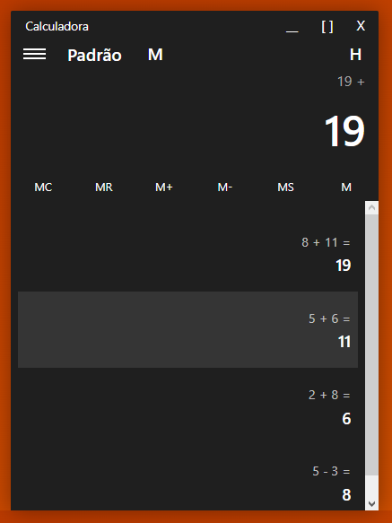

# Windows 10 Calculator (Version WEB)

Windows 10 calculator WEB is an application that simulates the native calculator of Windows 10, made with JavaScript, CSS and HTML.

---
## Screenshots

## How to use
You can access the application through the link below:

Also you can use it in your browser by downloading the files and running index.html.

